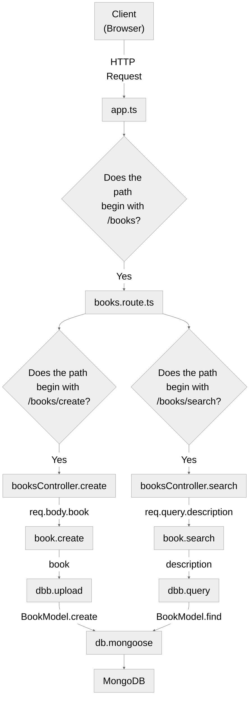

> [!IMPORTANT]  
> This repository is read-only / archived and will not recieve updates.

### Folder Structure:
```configs:``` contains all configurations e.g. database login info in db.config.ts<br>
```controllers:``` houses all controller methods which get requests from routes and convert them into HTTP responses using middleware and services as needed<br>
```middlewares:``` contains all middleware (software that lets software communicate with other software) in one place e.g. authentication<br>
```routes:``` single file for each logical set of routes e.g. routes for one type of resource, can be further broken down e.g. by versions of API<br>
```models:``` contains data models for database<br>
```services:``` contains all the business logic e.g. services to represent objects and methods to run queries on the database<br>

### Steps taken:
1. mkdir and cd
2. npm init -y
3. npm install express && npm install mongoose && npm install typescript
4. touch app.ts and added that code
5. npm i serverless-http
6. sudo npm install -g serverless
7. serverless --version to check install
8. export AWS_ACCESS_KEY_ID= then can test using printenv
9. export AWS_SECRET_ACCESS_KEY= (Note: to remove env vars just do exec bash)
10. touch serverless.yml and add that code
11. serverless deploy (do this last)
12. npm install mongodb express cors dotenv
13. mkdir routes and touch record.ts and added that code
14. tsc app.ts and record.ts
15. add Jest as dependency: npm i --save-dev @types/jest

### Backend HTTP Request Processing Diagram

